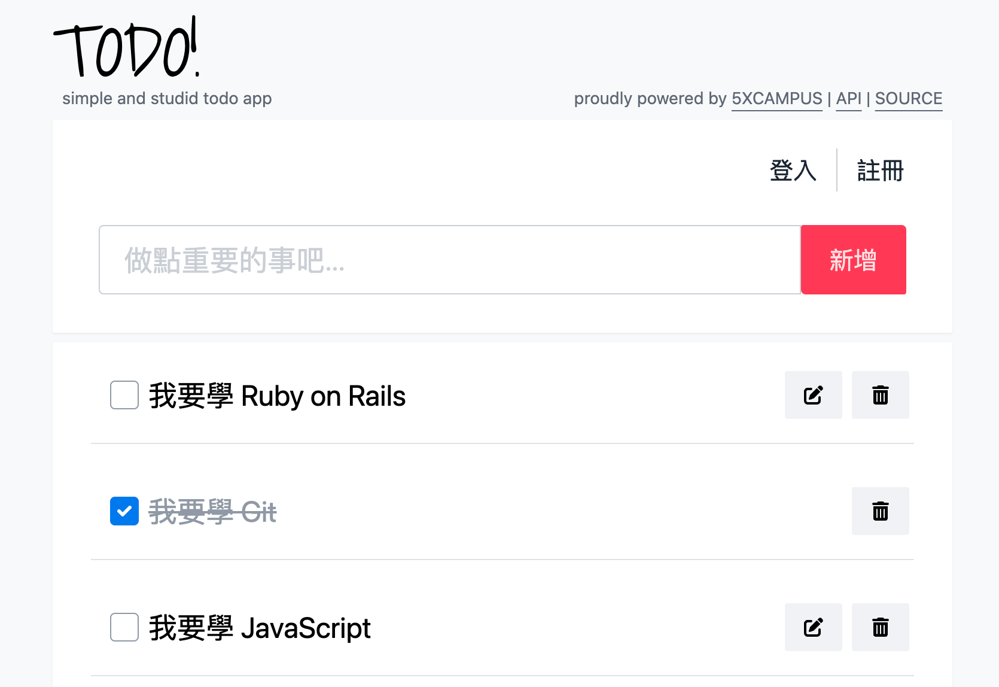

# Yet Another Simple TODO App Starter

## API & Docs

<https://todoo.5xcamp.us>

## Setup

- Install [Node](https://nodejs.org/en/) first.
- Clone or download this project.
- Run `npm install` to install packages needed.
- Run `npm run dev` to turn on development mode on your local machine, and check out `http://localhost:5173`.
- You may use any packages or frameworks as you want.
- Happy Hacking, and all PRs are welcome :)

## Tech Stacks

- [Tailwind CSS](https://tailwindcss.com/)
- [Vite](https://vite.dev/) as bulinding tool

by dev@5xcampus.com
